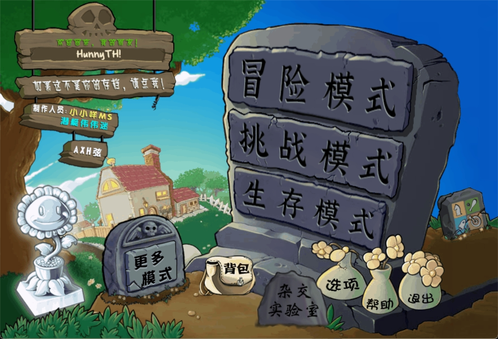
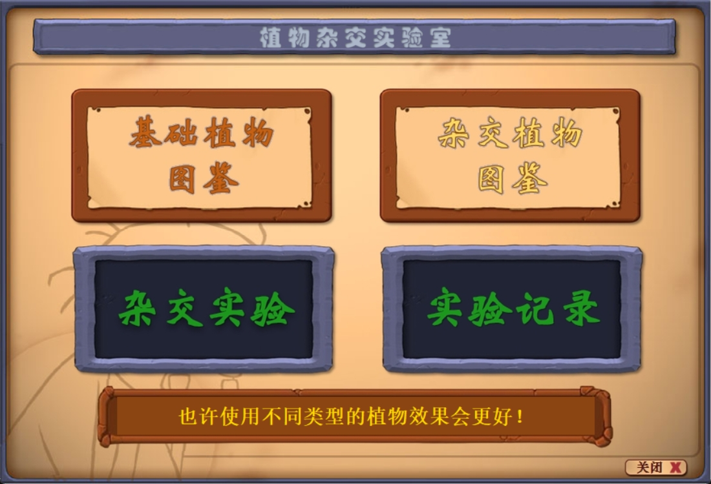
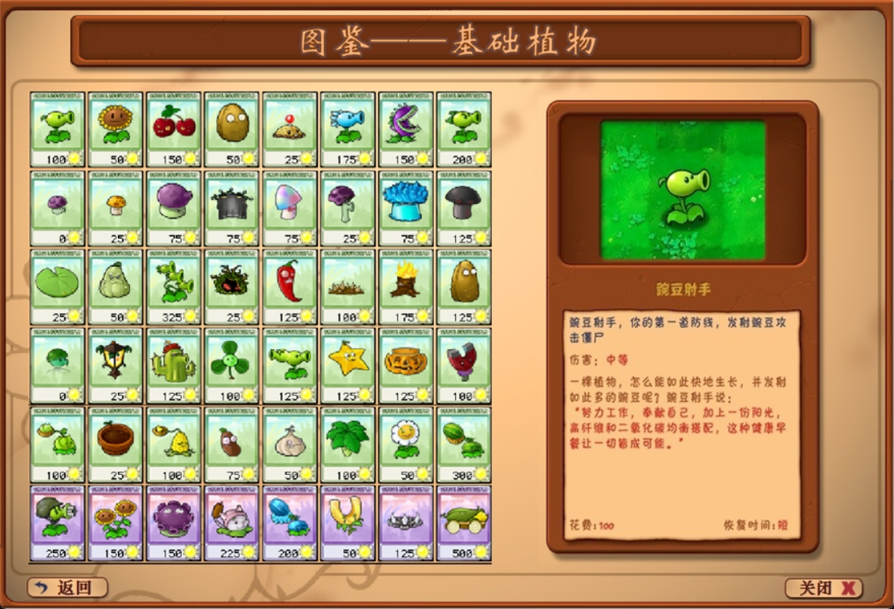
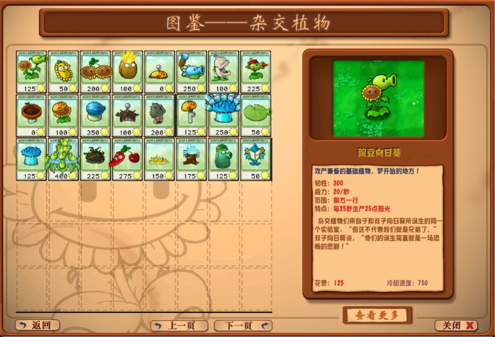
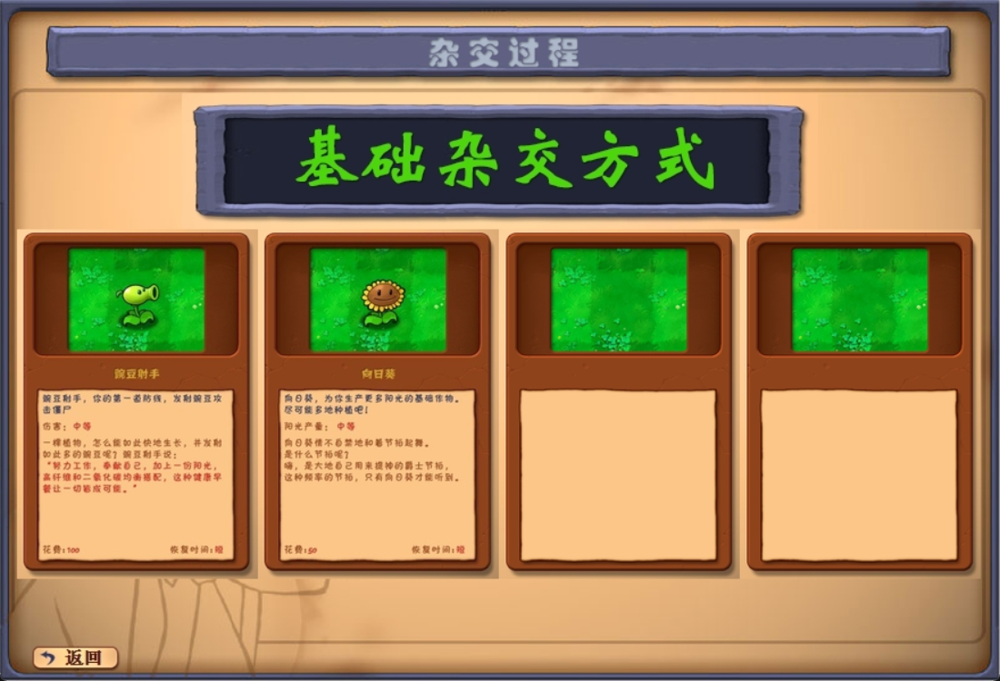
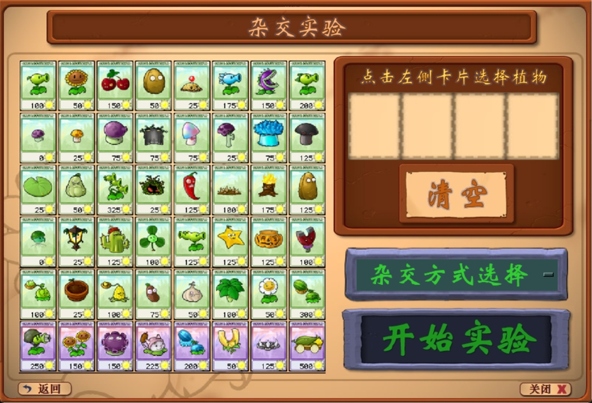
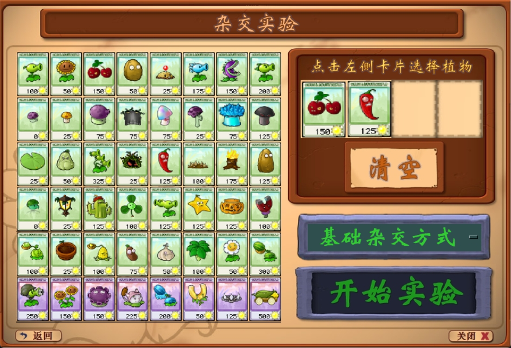
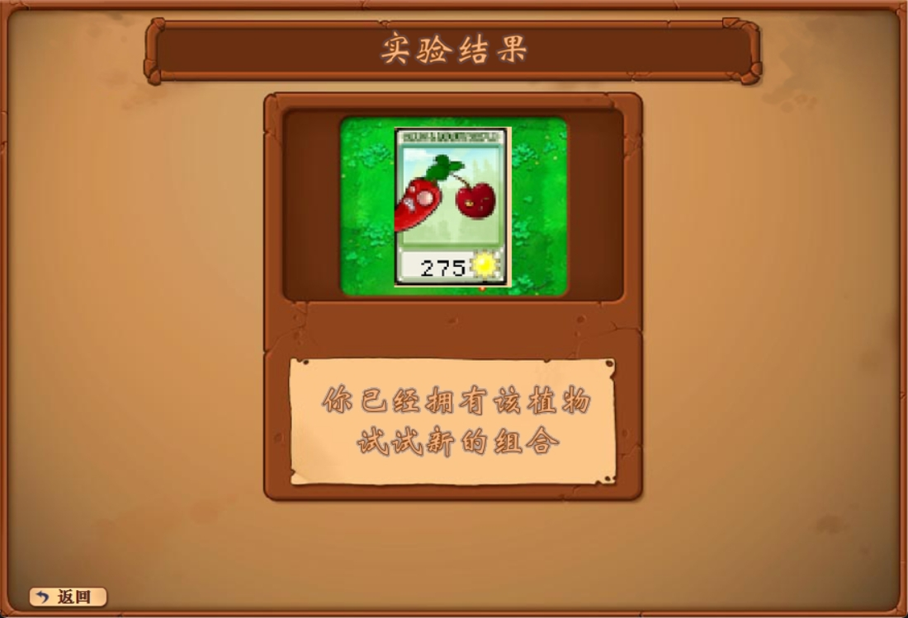
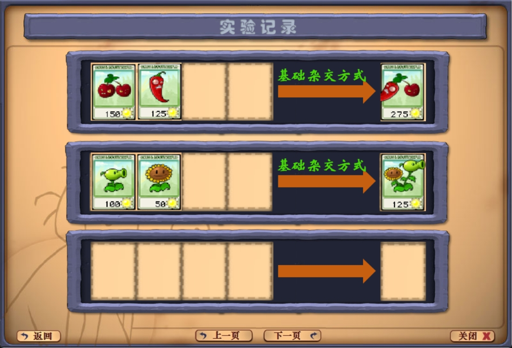

# 植物大战僵尸杂交版——杂交实验室
## 一、项目概述
### 项目背景
《植物大战僵尸杂交版》游戏因其创新的杂交植物概念而受到玩家喜爱。该游戏中的杂交植物结合了不同基础植物的特性，创造出新的具有更复杂技能效果的植物。在这个背景下，我计划在游戏主界面添加一个杂交试验室功能模块，让玩家能够创造、管理和体验这些杂交植物。
### 开发时间
2024.8.15-2024.8.25
### 开发
编程环境：Visual Studio code、Python 3.10.14
GUI：Tkinter
## 二、项目设计
### 游戏主界面

### 杂交实验室主界面

#### 基础植物图鉴

#### 杂交植物图鉴

##### 杂交植物更多信息查看

#### 杂交实验界面

##### 杂交实验

##### 杂交结果

#### 杂交历史记录界面

